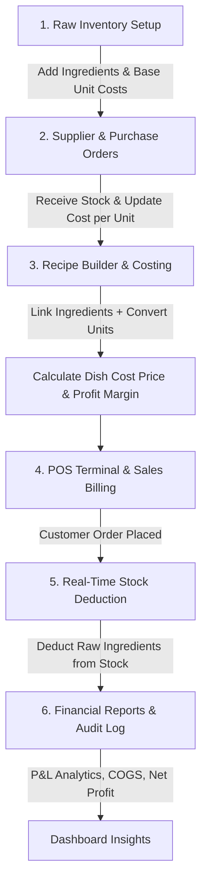

# 🍽️ Restaurant Inventory & Recipe Costing Management System

A modern, full-stack Restaurant Inventory, Recipe Costing, POS Sales, and Financial Management Application built with **Laravel 12**, **Inertia.js**, **React (TypeScript)**, **Tailwind CSS**, and **SweetAlert2**.

---

## 📋 Table of Contents

- [Overview](#-overview)
- [Key Features](#-key-features)
- [End-to-End System Workflow](#-end-to-end-system-workflow)
- [Deep Dive: Ingredient Costing & Unit Conversion](#-deep-dive-ingredient-costing--unit-conversion)
  - [Recipe Costing Formula](#recipe-costing-formula)
  - [Unit Conversion Logic](#unit-conversion-logic)
  - [Profit Margin Calculation](#profit-margin-calculation)
- [System Architecture & Modules](#-system-architecture--modules)
- [Database Entity Relationships](#-database-entity-relationships)
- [Technology Stack](#-technology-stack)
- [Installation & Setup](#-installation--setup)

---

## 🌟 Overview

The **Restaurant Inventory & Recipe Costing System** automates food cost management, inventory tracking, purchasing, POS sales, and profitability analytics for restaurants. 

By linking raw inventory ingredients directly to menu items through recipes, the system automatically calculates dish production costs, updates profit margins, and deducts raw stock in real-time whenever a sale is completed at the POS terminal.

---

## 🚀 Key Features

- 🥩 **Raw Inventory Tracking**: Manage stock levels, unit costs, reorder alerts, and safety stock thresholds.
- 📦 **Supplier & Purchase Management**: Create purchase orders, receive incoming stock, and update unit purchase prices dynamically.
- 📜 **Menu Catalog & Recipe Builder**: Define menu items, build precise ingredient recipes with custom units (`g`, `kg`, `ml`, `L`, `pcs`, etc.).
- 🧮 **Automated Recipe Costing**: Instant recalculation of dish cost prices (`cost_price`) and profit margins (`profit_margin`).
- 🛒 **POS Billing & Auto-Deduction**: Process orders quickly with automatic real-time deduction of raw recipe ingredients from inventory.
- 📊 **Financial Reports & P&L Analysis**: Comprehensive Profit & Loss calculations (Gross Revenue, Cost of Goods Sold (COGS), Operating Expenses, Net Profit).
- 👥 **HR & Employee Management**: Employee records, daily attendance tracking, and automated monthly salary generation.
- 💸 **Operational Expense Tracking**: Log utility bills, rent, maintenance, and custom business overheads.
- 🛡️ **Audit Logs & Security**: Detailed system audit logging for inventory movements, menu edits, purchases, and sales.

---

## 🔄 End-to-End System Workflow



### Operational Steps:

1. **Inventory Initialization (`/admin/inventory`)**:
   - Register raw items (e.g., *Flour*, *Beef*, *Milk*, *Eggs*) specifying base unit (`kg`, `L`, `pcs`) and `cost_per_unit`.

2. **Purchasing & Stock Inward (`/admin/purchases`)**:
   - Issue purchase orders to suppliers. When marked as **Completed**, stock quantities are incremented and the item's `cost_per_unit` is updated according to the latest vendor price.

3. **Recipe Building & Cost Calculation (`/admin/menu`)**:
   - Add menu items (e.g., *Cheeseburger*, *Latte*).
   - In the **Recipe Builder Modal**, select ingredients and specify quantities required per dish serving (e.g., `200 g Flour`, `50 ml Milk`).
   - The system executes unit conversion (`200 g` $\rightarrow$ `0.2 kg`) and calculates the exact ingredient cost price (`cost_price`).

4. **POS Order Processing (`/admin/sales`)**:
   - Select dishes on the POS interface and complete the transaction.
   - For every dish sold, the backend iterates through its recipe ingredients, converts recipe units to inventory units, and deducts the exact consumed quantity from raw stock balances.

5. **Financial & Inventory Analytics (`/admin/reports`)**:
   - Review gross revenue, total food cost (COGS), operating expenses, and net profit.

---

## 🧮 Deep Dive: Ingredient Costing & Unit Conversion

### Recipe Costing Formula

The dish cost price (`cost_price`) is calculated automatically by summing the cost of each raw ingredient used in its recipe:

$$\text{Ingredient Cost} = \sum_{i=1}^{n} \Big( \text{Converted Quantity}_i \times \text{Cost Per Unit}_i \Big)$$

Where:
- $\text{Converted Quantity}_i$: Recipe ingredient quantity converted into the raw inventory item's native unit.
- $\text{Cost Per Unit}_i$: Latest purchase cost per native unit from `inventory_items`.

#### Backend Implementation (`MenuController.php`):
```php
private function recalculateDishCost(MenuItem $menuItem): void
{
    $totalCost = 0;
    $recipes = $menuItem->recipes()->with('inventoryItem')->get();

    foreach ($recipes as $recipe) {
        if ($recipe->inventoryItem) {
            // 1. Convert recipe unit to inventory base unit
            $convertedQty = UnitConverterService::convert(
                $recipe->quantity, 
                $recipe->unit, 
                $recipe->inventoryItem->unit
            );

            // 2. Multiply by ingredient unit cost
            $ingredientCost = $convertedQty * $recipe->inventoryItem->cost_per_unit;
            $totalCost += $ingredientCost;
        }
    }

    // 3. Save rounded cost price
    $menuItem->cost_price = round($totalCost, 2);
    $menuItem->save();
}
```

---

### Unit Conversion Logic

The [`UnitConverterService`](file:///c:/xampp/htdocs/laravelwebsites/inventory_management/app/Services/UnitConverterService.php) normalizes unit differences between recipe measurements and inventory storage units:

- **Weight** (Base unit: `g` / `gram`):
  - `1 kg` = `1000 g`
  - `1 mg` = `0.001 g`
- **Volume** (Base unit: `ml` / `milliliter`):
  - `1 L` = `1000 ml`
- **Count** (Base unit: `pc` / `piece`):
  - `1 dozen` = `12 pcs`

*Example*: If a recipe calls for `250 g` of Cheese and Cheese is stored in `kg` at `$10.00 / kg`:
$$\text{Converted Quantity} = \frac{250 \text{ g}}{1000} = 0.25 \text{ kg}$$
$$\text{Ingredient Cost} = 0.25 \text{ kg} \times \$10.00/\text{kg} = \$2.50$$

---

### Profit Margin Calculation

Both the backend model ([`MenuItem.php`](file:///c:/xampp/htdocs/laravelwebsites/inventory_management/app/Models/MenuItem.php)) and frontend view compute the profit margin percentage as:

$$\text{Profit Margin \%} = \left( \frac{\text{Selling Price} - \text{Ingredient Cost}}{\text{Selling Price}} \right) \times 100$$

*Example*: If Selling Price = `$15.00` and Ingredient Cost = `$4.50`:
$$\text{Profit Margin \%} = \left( \frac{15.00 - 4.50}{15.00} \right) \times 100 = 70.0\%$$

---

## 🏗️ System Architecture & Modules

| Module | Route | Key Responsibilities |
| :--- | :--- | :--- |
| **Dashboard** | `/admin/dashboard` | Key performance indicators, low stock warnings, recent orders, sales charts |
| **Inventory** | `/admin/inventory` | Manage raw items, stock levels, safety stock, manual adjustments, CSV export |
| **Purchases** | `/admin/purchases` | Vendor POs, receiving stock, cost price updates |
| **Menu Catalog** | `/admin/menu` | Menu dishes, categories, images, recipe builder, automated dish costing |
| **POS Sales** | `/admin/sales` | Quick billing terminal, stock auto-deduction, order history log |
| **Expenses** | `/admin/expenses` | Operational expenses, category breakdown |
| **HR & Payroll** | `/admin/employees` | Staff management, daily attendance, salary slip generation |
| **Financial Reports** | `/admin/reports` | Profit & Loss statement, COGS breakdown, daily report trigger |
| **Suppliers** | `/admin/suppliers` | Vendor details, contact info, transaction history |
| **Audit Logs** | `/admin/audit-logs` | System change tracking, user action history |
| **Settings** | `/admin/settings` | Currency configuration, tax rates, database backups |

---

## 🗄️ Database Entity Relationships

- `categories` **1 : N** `menu_items` & `inventory_items`
- `inventory_items` **1 : N** `recipes` **N : 1** `menu_items`
- `suppliers` **1 : N** `purchases` **1 : N** `purchase_items`
- `orders` **1 : N** `order_items` **N : 1** `menu_items`
- `employees` **1 : N** `attendance_logs` & `salaries`
- `inventory_items` **1 : N** `inventory_movements`

---

## 🛠️ Technology Stack

- **Backend**: Laravel 12, PHP 8.2+
- **Frontend**: Inertia.js (React 18 + TypeScript)
- **Styling & UI**: Tailwind CSS, Lucide React Icons
- **Alerts & Modals**: SweetAlert2 (Custom styled dark/light theme integration)
- **Database**: MySQL / PostgreSQL / SQLite

---

## ⚙️ Installation & Setup

1. **Clone & Navigate**:
   ```bash
   git clone <repository-url>
   cd inventory_management
   ```

2. **Install Dependencies**:
   ```bash
   composer install
   npm install
   ```

3. **Configure Environment**:
   ```bash
   cp .env.example .env
   php artisan key:generate
   ```

4. **Run Migrations & Seeders**:
   ```bash
   php artisan migrate --seed
   ```

5. **Start Application Servers**:
   ```bash
   # In Terminal 1 (Laravel Dev Server)
   php artisan serve

   # In Terminal 2 (Vite Frontend Builder)
   npm run dev
   ```

6. **Access Dashboard**:
   Navigate to `http://127.0.0.1:8000/admin/dashboard` in your browser.
