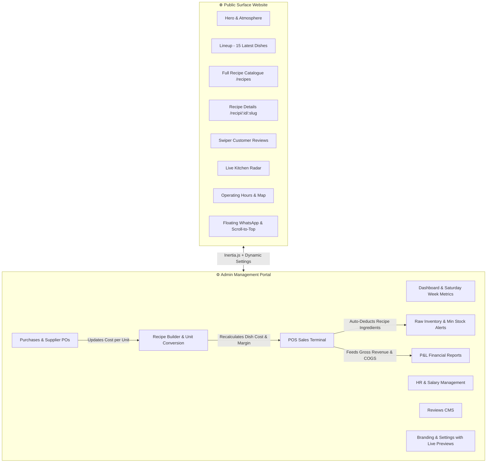
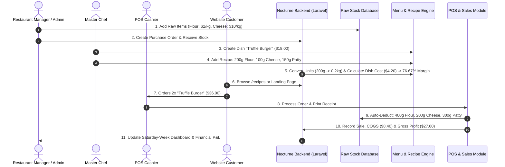

# 🍽️ NOCTURNE — Enterprise Restaurant Inventory, Recipe Costing & Gourmet Surface System

A high-performance, full-stack Restaurant Inventory, Recipe Costing, POS Terminal, Financial Analytics, and Public Surface Experience built with **Laravel 12**, **Inertia.js**, **React 18 (TypeScript)**, **Tailwind CSS**, **Swiper.js 11**, **AOS (Animate On Scroll)**, and **SweetAlert2**.

---

## 📋 Table of Contents

- [🌟 System Overview](#-system-overview)
- [✨ Key Highlights & Dual Architecture](#-key-highlights--dual-architecture)
  - [1. Public Gourmet Surface Experience](#1-public-gourmet-surface-experience)
  - [2. Admin Operations & Management Portal](#2-admin-operations--management-portal)
- [🔄 End-to-End System Workflow](#-end-to-end-system-workflow)
- [🧮 Costing, Conversion & Financial Calculations](#-costing-conversion--financial-calculations)
  - [Recipe Costing Formula](#recipe-costing-formula)
  - [Unit Conversion Logic](#unit-conversion-logic)
  - [Profit Margin Calculation](#profit-margin-calculation)
  - [Custom Week Calculation (Saturday Start Default)](#custom-week-calculation-saturday-start-default)
- [📱 WhatsApp Integration & Ordering Control](#-whatsapp-integration--ordering-control)
- [🏗️ System Architecture & Module Directory](#️-system-architecture--module-directory)
- [🗄️ Database Entity Relationships](#️-database-entity-relationships)
- [🛠️ Technology Stack](#️-technology-stack)
- [⚙️ Installation & Seeding Guide](#️-installation--seeding-guide)

---

## 🌟 System Overview

**NOCTURNE** delivers a complete dual-layer solution designed for modern restaurants and nightlife dining establishments:

1. **Customer-Facing Surface**: An ultra-premium, dark/light themed public website featuring a high-energy late-night aesthetic, live dish lineups, dedicated recipe catalogues (`/recipes`), dynamic Swiper customer reviews, interactive operating schedules, and WhatsApp/Voice order integrations.
2. **Back-Office Operations**: A robust inventory and financial management control center featuring automated recipe costing, real-time raw ingredient deduction upon POS billing, supplier purchase orders, employee payroll, audit logging, and configurable calendar rules (Saturday-starting financial weeks).

---

## ✨ Key Highlights & Dual Architecture



---

### 1. Public Gourmet Surface Experience

- **Midnight Aesthetic & Theme Switcher**: Sleek dark mode by default with rich copper-amber accents, glassmorphism panels, and instant toggle to high-contrast light mode.
- **Hero & Atmospheric Storytelling**: Dynamic hero section with customizable background images, typography, and live kitchen status indicators.
- **The Lineup (Latest 15 Items)**: Clean showcase on the landing page displaying the top 15 latest culinary dishes with category filter tabs, search, and a direct "View All Recipes" link.
- **Dedicated All Recipes Page (`/recipes`)**: Comprehensive catalogue of all restaurant recipes with search by name, ingredient, or category, and responsive grid layouts.
- **Rich Recipe Detail Pages (`/recipi/{id}/{slug}`)**: Dedicated view for each dish featuring culinary preparation notes, ingredient highlights, dynamic pricing, social sharing, and structured JSON-LD SEO schema.
- **Dynamic Swiper Reviews Carousel**: Auto-playing testimonial slider powered by Swiper 11, populated with seeded 5-star and 4-star verified customer reviews and fully manageable from the admin panel.
- **Live Telemetry Kitchen Radar**: Simulated real-time kitchen station status (Grill Brigade, Prep Station, Expediter, Dispatch Courier).
- **Dynamic Operating Hours**: Multi-line opening hours loaded from App Settings, rendering peak-night highlights automatically.
- **Floating Action Stack**: Smooth scroll-to-top button paired with a bottom-right circular WhatsApp contact button with live pulsing online indicator.

---

### 2. Admin Operations & Management Portal

- **Configurable Week Start Day (Default: Saturday)**: Select any day of the week to serve as the start of the business week. All weekly P&L reports, POS sales filters, and dashboard trend charts automatically recalculate based on this calendar setting.
- **Automated Recipe Costing**: Link raw inventory ingredients to menu dishes with custom units (`g`, `kg`, `ml`, `L`, `pcs`, `dozen`). The system automatically converts units and calculates dish cost price (`cost_price`) and profit margin.
- **Point of Sale (POS) Billing & Auto-Deduction**: Process customer orders with receipt generation, cash/card payment logging, and instant automated deduction of raw recipe ingredients from inventory balances.
- **Suppliers & Purchase Orders**: Track vendor price fluctuations. When purchase orders are received, inventory quantities increase and raw ingredient unit costs are updated across all recipes.
- **P&L Financial Analytics & Excel Export**: Track Gross Revenue, Cost of Goods Sold (COGS), Operating Expenses, and Net Profit across customizable date ranges with one-click Excel/CSV export.
- **HR, Attendance & Payroll**: Staff database with daily attendance tracking, overtime calculation, and automated monthly salary generation.
- **Review Moderation CMS (`/admin/reviews`)**: Create, approve, edit, and feature customer testimonials displayed on the public landing page.
- **App Settings & Dynamic Media (`/admin/settings`)**: Live preview uploaders for Hero backgrounds, Atmosphere images, VIP lounge media, and brand logos; multi-line operating hours editor; WhatsApp toggle; and business rules.

---

## 🔄 End-to-End System Workflow



---

## 🧮 Costing, Conversion & Financial Calculations

### Recipe Costing Formula

The dish cost price (`cost_price`) is calculated automatically by converting each ingredient's quantity to its native inventory storage unit and multiplying by the latest unit purchase cost:

$$\text{Dish Cost Price} = \sum_{i=1}^{n} \Big( \text{Converted Quantity}_i \times \text{Cost Per Unit}_i \Big)$$

#### Backend Implementation (`MenuController.php`):
```php
private function recalculateDishCost(MenuItem $menuItem): void
{
    $totalCost = 0;
    $recipes = $menuItem->recipes()->with('inventoryItem')->get();

    foreach ($recipes as $recipe) {
        if ($recipe->inventoryItem) {
            // 1. Convert recipe unit (e.g. 'g') to inventory storage unit (e.g. 'kg')
            $convertedQty = UnitConverterService::convert(
                $recipe->quantity, 
                $recipe->unit, 
                $recipe->inventoryItem->unit
            );

            // 2. Multiply converted quantity by latest inventory cost per unit
            $ingredientCost = $convertedQty * $recipe->inventoryItem->cost_per_unit;
            $totalCost += $ingredientCost;
        }
    }

    // 3. Persist exact calculated cost price
    $menuItem->cost_price = round($totalCost, 2);
    $menuItem->save();
}
```

---

### Unit Conversion Logic

The [`UnitConverterService`](file:///c:/xampp/htdocs/laravelwebsites/inventory_management/app/Services/UnitConverterService.php) normalizes unit differences across all standard culinary and inventory metrics:

- **Mass / Weight** (Base unit: `g`):
  - `1 kg` = `1,000 g`
  - `1 mg` = `0.001 g`
  - `1 lb` = `453.592 g`
  - `1 oz` = `28.3495 g`
- **Volume / Liquid** (Base unit: `ml`):
  - `1 L` = `1,000 ml`
  - `1 cl` = `10 ml`
  - `1 cup` = `240 ml`
  - `1 tbsp` = `15 ml`
  - `1 tsp` = `5 ml`
- **Discreet Count** (Base unit: `pc`):
  - `1 dozen` = `12 pcs`
  - `1 pair` = `2 pcs`

*Conversion Example*: A recipe calls for `250 g` of Cheddar Cheese, stored in inventory by `kg` at `$12.00 / kg`:
$$\text{Converted Quantity} = \frac{250 \text{ g}}{1000} = 0.25 \text{ kg}$$
$$\text{Cost Contribution} = 0.25 \text{ kg} \times \$12.00/\text{kg} = \$3.00$$

---

### Profit Margin Calculation

$$\text{Profit Margin \%} = \left( \frac{\text{Selling Price} - \text{Ingredient Cost}}{\text{Selling Price}} \right) \times 100$$

*Example*: Selling Price = `$20.00`, Ingredient Cost = `$5.00`:
$$\text{Profit Margin \%} = \left( \frac{20.00 - 5.00}{20.00} \right) \times 100 = 75.0\%$$

---

### Custom Week Calculation (Saturday Start Default)

In many regions and commercial restaurant operations, business reporting cycles start on **Saturday** rather than Sunday or Monday.

The system encapsulates this logic in [`AppSetting::getWeekRange()`](file:///c:/xampp/htdocs/laravelwebsites/inventory_management/app/Models/AppSetting.php):

```php
public static function getWeekRange(?Carbon $date = null): array
{
    $targetDate = $date ? $date->copy() : Carbon::now();
    $weekStartDay = self::getWeekStartDay(); // Defaults to CarbonInterface::SATURDAY

    // Calculate Week Start (Saturday 00:00:00)
    $startOfWeek = $targetDate->copy()->startOfWeek($weekStartDay);
    if ($targetDate->dayOfWeek < $weekStartDay) {
        $startOfWeek->subWeek();
    }
    $startOfWeek->startOfDay();

    // Calculate Week End (Friday 23:59:59)
    $endOfWeek = $startOfWeek->copy()->addDays(6)->endOfDay();

    return [$startOfWeek, $endOfWeek];
}
```

This ensures that:
- **Weekly Dashboard Profit Breakdowns** capture Saturday to Friday revenue and expenses.
- **7-Day Trend Charts** begin on Saturday.
- **Financial P&L Weekly Reports** aggregate exact Saturday-to-Friday financial periods.
- **POS Sales Log** "This Week" presets filter Saturday 00:00:00 to current timestamp.

---

## 📱 WhatsApp Integration & Ordering Control

Administrators can enable or disable WhatsApp customer integration with a single toggle in **App Settings** (`/admin/settings`):

| State | Public Surface Header | Dish & Recipe Cards | Floating Bottom-Right Stack |
| :--- | :--- | :--- | :--- |
| **Enabled (Active)** | Links to `https://wa.me/{number}` with prefilled order text | "Order" button opens WhatsApp chat with dish details | Displays floating WhatsApp logo with 24/7 pulsing indicator |
| **Disabled (Hidden)** | Switches to "Call Kitchen" (`tel:{phone}`) | "Call" button opens phone dialer | Floating WhatsApp button is hidden (retains Scroll-to-Top) |

---

## 🏗️ System Architecture & Module Directory

| Module | Route | Controller | Primary Capabilities |
| :--- | :--- | :--- | :--- |
| **Surface Landing** | `/` | `PublicController@welcome` | Hero section, Lineup (15 dishes), Atmosphere, Radar, Reviews slider, Map |
| **Recipe Catalogue** | `/recipes` | `PublicController@recipes` | Complete searchable recipe catalogue by category |
| **Recipe Detail** | `/recipi/{id}/{slug}` | `PublicController@recipeDetail` | In-depth recipe view, culinary notes, social share, WhatsApp/Call CTA |
| **Admin Dashboard** | `/admin/dashboard` | `DashboardController@index` | Saturday-week KPI cards, profit breakdown, low stock alerts, sales chart |
| **Raw Inventory** | `/admin/inventory` | `InventoryController` | Item registry, stock balances, reorder points, manual adjustments, CSV export |
| **Suppliers & POs** | `/admin/purchases` | `PurchaseController` | Purchase orders, stock inward, auto-cost updates |
| **Menu & Costing** | `/admin/menu` | `MenuController` | Dishes, categories, recipe builder, automated dish costing |
| **POS Sales** | `/admin/sales` | `SalesController` | Fast billing terminal, recipe auto-deduction, invoice printing, sales log |
| **Customer Reviews** | `/admin/reviews` | `ReviewController` | Testimonials CMS, star ratings, review moderation |
| **P&L Reports** | `/admin/reports` | `ReportController` | Profit & Loss statement, COGS analysis, Excel exports |
| **HR & Salaries** | `/admin/employees` | `EmployeeController` | Staff records, attendance log, monthly salary generation |
| **Expenses** | `/admin/expenses` | `ExpenseController` | Operating overheads, utilities, rent, maintenance logging |
| **App Settings** | `/admin/settings` | `SettingController` | Branding images, WhatsApp toggle, Week start day, Operating hours |
| **Audit Logs** | `/admin/audit-logs` | `AuditLogController` | Full system audit trail and user action history |

---

## 🗄️ Database Entity Relationships

- `categories` **1 : N** `menu_items` & `inventory_items`
- `inventory_items` **1 : N** `recipes` **N : 1** `menu_items`
- `suppliers` **1 : N** `purchases` **1 : N** `purchase_items`
- `orders` **1 : N** `order_items` **N : 1** `menu_items`
- `employees` **1 : N** `attendance_logs` & `salaries`
- `inventory_items` **1 : N** `inventory_movements`
- `reviews` (Independent model for public testimonials & ratings)
- `app_settings` (Key-value store for branding, business rules, hours, and toggles)

---

## 🛠️ Technology Stack

- **Backend Framework**: [Laravel 12](https://laravel.com/) (PHP 8.2+)
- **SPA Bridge**: [Inertia.js](https://inertiajs.com/)
- **Frontend Framework**: [React 18](https://react.dev/) with [TypeScript](https://www.typescriptlang.org/)
- **Styling**: [Tailwind CSS](https://tailwindcss.com/) & Custom Vanilla CSS Tokens
- **Carousel Engine**: [Swiper 11](https://swiperjs.com/)
- **Scroll Animations**: [AOS (Animate On Scroll)](https://michalsnik.github.io/aos/)
- **Icons**: [Lucide React](https://lucide.dev/)
- **Modals & Alerts**: [SweetAlert2](https://sweetalert2.github.io/)
- **Database**: MySQL 8.0+ / MariaDB / PostgreSQL

---

## ⚙️ Installation & Seeding Guide

### 1. Prerequisites
- PHP `>= 8.2` with `pdo`, `mbstring`, `openssl`, `bcmath`, `xml`, `curl` extensions.
- Composer `>= 2.5`
- Node.js `>= 18` & npm
- MySQL / MariaDB Server

### 2. Setup Steps

```bash
# 1. Clone repository
git clone <repository-url>
cd inventory_management

# 2. Install backend dependencies
composer install

# 3. Install frontend dependencies
npm install

# 4. Configure environment variables
cp .env.example .env
php artisan key:generate

# 5. Configure MySQL database in .env
# DB_DATABASE=inventory_management
# DB_USERNAME=root
# DB_PASSWORD=

# 6. Run migrations & database seeders (Seeds 10 customer reviews, default branding & settings)
php artisan migrate --seed

# 7. Create storage symlink for uploaded branding media
php artisan storage:link
```

### 3. Running Dev Servers

```bash
# Terminal 1: Laravel Backend Server
php artisan serve

# Terminal 2: Vite Frontend HMR Server
npm run dev
```

### 4. Default Access Points

- **Public Surface Website**: `http://localhost:8000/`
- **All Recipes Catalogue**: `http://localhost:8000/recipes`
- **Admin Control Center**: `http://localhost:8000/admin/dashboard`
- **Default Admin Credentials**:
  - **Email**: `admin@restaurant.com`
  - **Password**: `password` (or as configured in `DatabaseSeeder.php`)

---

*Crafted with precision for high-volume restaurant and nightlife hospitality.*
